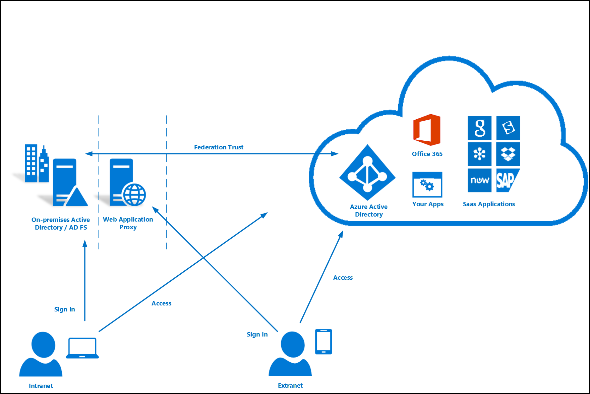

<properties 
	pageTitle="Azure AD Connect - User Sign In" 
	description="Azure AD Connect user sign in for custom settings." 
	services="active-directory" 
	documentationCenter="" 
	authors="billmath" 
	manager="terrylan" 
	editor="bryanla"/>

<tags 
	ms.service="azure-active-directory-connect" 
	ms.workload="identity" 
	ms.tgt_pltfrm="na" 
	ms.devlang="na" 
	ms.topic="article" 
	ms.date="05/28/2015" 
	ms.author="billmath"/>

# Azure AD Connect User Sign on options

Azure AD Connect allows your users to sign on to both cloud and on premises resources using the same passwords.  You can choose from several different ways to enable this.

### Password synchronization
With password synchronization, hashes of user passwords are synchronized from your on premises Active Directory to Azure AD.  When passwords are changed or reset on premises, the new passwords are synchronized immediately to Azure AD so that your users can always use the same password for cloud resources as they do on premises.  The passwords are never sent to Azure AD nor stored in Azure AD in clear text.
Password synchronization can be used together with password write-back to enable self service password reset in Azure AD.

[More information about password synchronization](https://msdn.microsoft.com/library/azure/dn246918.aspx)

### Federation using a new or existing AD FS in Windows Server 2012 R2 farm
With federated sign on, your users can sign on to Azure AD based services with their on premises passwords and, while on the corporate network, without having to enter their passwords again.  The federation option with AD FS allows you to deploy a new or specify an existing AD FS in Windows Server 2012 R2 farm.  If you choose to specify an existing farm, Azure AD Connect will configure the trust between your farm and Azure AD so that your users can sign on.

#### To deploy Federation with AD FS in Windows Server 2012 R2, you will need the following
If you are deploying a new farm:

- A Windows Server 2012 R2 server for the federation server.
- A Windows Server 2012 R2 server for the Web Application Proxy.
- a .pfx file with one SSL certificate for your intended federation service name, such as fs.contoso.com.

If you are deploying a new farm or using an existing farm:

- Local administrator credentials on your federation servers.
- Local administrator credentials on any workgroup (non-domain joined) servers on which you intend to deploy the Web Application Proxy role.
- The machine on which you execute the wizard must be able to connect to any other machines on which you want to install AD FS or Web Application Proxy via Windows Remote Management.

#### Sign on using an earlier version of AD FS or a third party solution
If you have already configured cloud sign on using an earlier version of AD FS (such as AD FS 2.0) or a third party federation provider, you can choose to skip user sign in configuration via Azure AD Connect.  This will enable you to get the latest synchronization and other capabilities of Azure AD Connect while still using your existing solution for sign on.

### Choosing the a User sign-in method for your organization
For most organizations who just want to enable user sign on to Office 365, SaaS applications and other Azure AD based resources, the default Password synchronization option is recommended.
Some organizations, however, have particular reasons for using a federated sign on option such as AD FS.  These include: 

- Your organization already has AD FS or a 3rd party federation provider deployed
- Your security policy prohibits synchronizing password hashes to the cloud
- You require that users experience seamless SSO (without additional password prompts) when accessing cloud resources from domain joined machines on the corporate network
- You require some specific capabilities AD FS has
	- On premises multi-factor authentication using a third party provider or smart cards (learn about third party MFA providers for AD FS in Windows Server 2012 R2)
	- Active Directory integration features such as soft account lockout or AD password and work hours policy
	- Conditional access to both on premises and cloud resources using device registration, Azure AD join, or Microsoft Intune MDM policies
