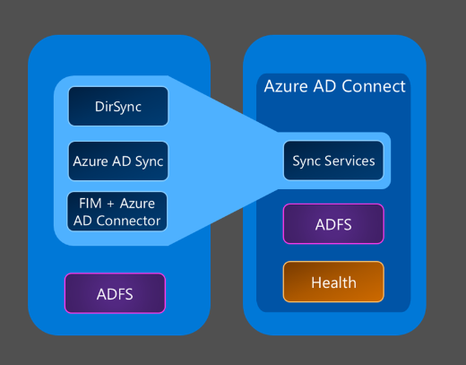

<properties
	pageTitle="Azure AD Connect Sync Scenario Overview"
	description="Explains users and contacts in Azure AD Connect Sync."
	services="active-directory"
	documentationCenter=""
	authors="markusvi"
	manager="swadhwa"
	editor=""/>

<tags
	ms.service="active-directory"
	ms.workload="identity"
	ms.tgt_pltfrm="na"
	ms.devlang="na"
	ms.topic="article"
	ms.date="07/27/2015"
	ms.author="markusvi"/>

# Azure AD Connect Sync: Customizing Synchronization options

The Azure Active Directory Connect Synchronization Services (Azure AD Connect Sync) is a main component of Azure AD Connect that takes care of all the operations that are related to synchronizing identity data between your on-premises environment and Azure AD in the cloud. From a synchronization perspective, Azure AD Connect Sync is the successor of DirSync, Azure AD Sync and Forefront Identity Manager with the Active Directory Connector configured.

The objective of this topic is to provide you with links to topics that are related to Auzre AD Connect Sync.

What do you want to do next?:

- For an overview of the technical concepts, see [Technical Concepts](active-directory-aadconnectsync-technical-concepts.md).
- For an overview of the multi-forest scenarios supported by Azure AD Connect Sync, see [Multi-forest Scenario Overview](active-directory-aadconnectsync-scenario-overview.md).
- If you want to learn about how implement a filter, see [Configure Filtering](active-directory-aadconnectsync-configure-filtering.md).
- If you want to know more about password synchronization, see [Implement password synchronization](active-directory-aadconnectsync-implement-password-synchronization.md).
- If you want to know more about users and contacts in Azure AD Connect Sync, see [Understanding Users and Contacts](active-directory-aadconnectsync-understanding-users-and-contacts.md).
- If you want to change the default configuration, see [active-directory-aadconnectsync-best-practices-changing-default-configuration](active-directory-aadconnectsync-best-practices-changing-default-configuration.md)
- If you want to explore the attributes that are synchronized to Azure AD, see [active-directory-aadconnectsync-attributes-synchronized](active-directory-aadconnectsync-attributes-synchronized.md)
- If you want to learn more about declarative provisioning, see [Understanding Declarative Provisioning Expressions](active-directory-aadconnectsync-understanding-declarative-provisioning-expressions.md)
- To explore the declarative provisioning functions, see [Functions Reference](active-directory-aadconnectsync-functions-reference.md)

## Additional Resources

* [Sign up for Azure as an organization](sign-up-organization.md)

 
<!--Image references-->
