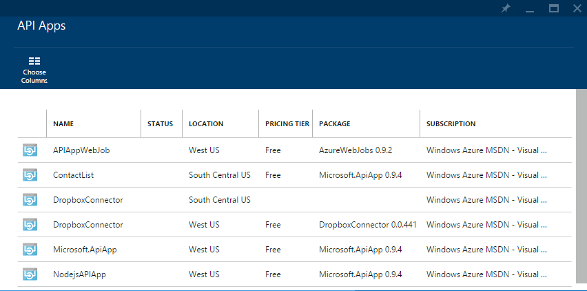
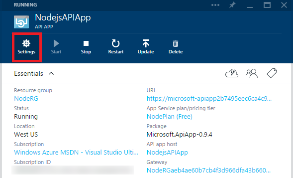
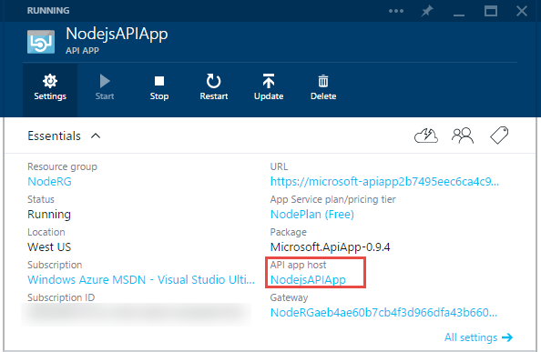
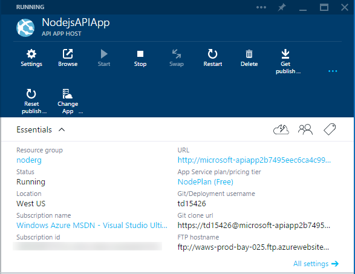
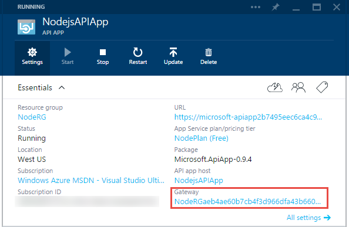
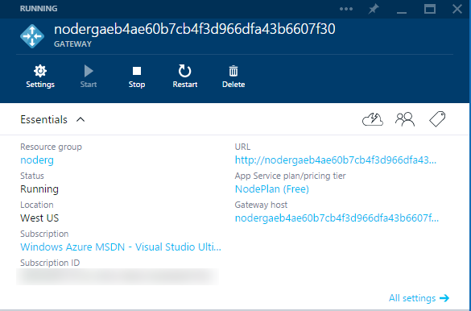
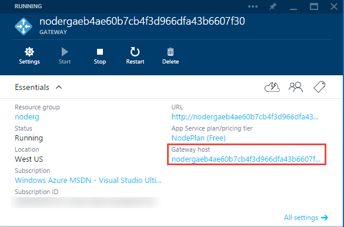
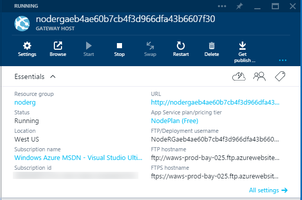

<properties 
	pageTitle="Manage API apps" 
	description="Learn how to manage Azure App Service API apps by using the Azure portal and Visual Studio Server Explorer." 
	services="app-service\api" 
	documentationCenter="" 
	authors="tdykstra" 
	manager="wpickett" 
	editor="jimbe"/>

<tags 
	ms.service="app-service-api" 
	ms.workload="web" 
	ms.tgt_pltfrm="na" 
	ms.devlang="na"
	ms.topic="article" 
	ms.date="06/17/2015" 
	ms.author="tdykstra"/>

# Manage API apps in Azure App Service

This article shows how use the [Azure preview portal](https://portal.azure.com/) to perform API app management and monitoring tasks. Here are some of the tasks you can do:

- Configure authentication 
- Enable auto-scaling
- View logs
- See how many requests are made and see how much data is being used by an API app
- Backup an API App and create alerts
- Configure role-based access security

The article also shows how to do some management tasks in the Server Explorer window in Visual Studio.

## API app and gateway blades in the Azure preview portal

In Azure App Service an API app is a [web app](../app-service-web/app-service-web-overview.md) that has additional features for hosting web services. In the Azure portal, there is an **API app** blade for managing the API-specific features, and an **API App host** blade for managing the underlying web app. 

Every resource group that contains at least one API app also includes a  *gateway*. The gateway acts as a proxy, handling authentication and other administrative functions for all API apps in a resource group. Like an API app, a gateway is a web app with extra functionality, so there are also two portal blades for managing the gateway: a **Gateway** blade for gateway-specific functions, and a **Gateway host** blade for managing the underlying web app.

### Tasks you can do only on the API App blade

You use the **API app** blade for the following tasks:

- Configure access level - Click **Settings > Application settings**. The default value is internal, which means only API apps in the same resource group are allowed to call the API app. For more information, see [Protect an API app](app-service-api-dotnet-add-authentication.md).   
- Configure update policy - Click **Settings > Application settings**. Default value is **On**. This means that when a new version of the API app is published to the marketplace, your API app will automatically be updated to the new version if it is a non-breaking change.  
- Configure authentication for outgoing calls from the API app - Click **Settings > Authentication**.  If the API app makes calls to an external service that requires authentication, the required configuration values are entered here. For example, a Dropbox connector requires a client ID and a client secret to access the Dropbox service.
- Configure [RBAC](../role-based-access-control-configure.md) - Click **Settings > Users**. User access that you configure here determines only who can access the API-app-specific features. To configure RBAC for the web app features, use the **API app host** blade. Normally you would want to keep the RBAC settings for the API app and the API app host in sync. If you give someone access to the API app but not the API app host, they won't be able to use the features on the **API app** blade that actually pertain to the API app host.
- View API definition - Click **API definition** in the **Summary** section to see a list of the methods exposed by the **API app**.
- [Install the Hybrid Connection Manager](](../app-service-logic/app-service-logic-hybrid-connection-manager.md). (Applies to built-in connector API apps.) The Hybrid Connection Manager gives you the ability to connect to an on-premises system, like SQL Server or SAP. This hybrid connectivity uses Azure Service Bus to connect and control the security between your Azure resources and your on-premises resources.

### Tasks you can do on both the API app blade and the API app host blade 

The **API app** blade enables you to do many tasks that pertain to the underlying web app. For example, you can do the following tasks:

* Stop, start, and restart the web app that hosts the API app.  
- Select **Requests and errors** to add different performance metrics including commonly-known HTTP error codes, like 200, 400, or 500 HTTP status codes.
- See response times, see how many requests are made to the API App, and see how much data comes in and how much data goes out. 
- Create email Alerts if a metric exceeds a threshold of your choosing. 
- See how much **CPU** is used by the API App, review the current **Usage Quota** in MB, and see your maximum data usage based on your cost tier.
- See **Estimated spend**  to determine the potential costs of running your API App.
- View the application logs and other IIS logs, including web server logs and FREB logs.
- Select **Processes** to open Process Explorer. This shows your web instances and their properties, including thread count and memory usage.

These tasks can also be done by using the **API app host** blade.  This is why the two blades share much of the same UI. For example, The **Stop**, **Start**, and **Restart** buttons on the **API app** blade have exactly the same effect as the **Stop**, **Start**, and **Restart** buttons on the **API App Host** blade. Likewise, the monitoring information provided on the **API app** blade is the same as what the **API app host** blade shows. 

The only functions provided on **API app** blade that are not duplicates from the **API app host** blade are listed in the previous section.

### Tasks you can do only on the API app Host blade

You use the **API App Host** blade for all of the tasks that you would do for any web app. For more information, see [Manage web apps in the portal](../app-service-web/web-sites-manage.md).  

### Tasks you can do only on the gateway blade

You use the **Gateway** blade for the following tasks:

- Authentication provider configuration for incoming calls to API apps - Click **Settings > Identity**. If the gateway needs to authenticate users before allowing them to call API apps in the resource group, the required configuration values are entered here. For more information, see [Configure and test a SaaS connector in Azure App Service](app-service-api-connnect-your-app-to-saas-connector.md). 
- Configure [RBAC](../role-based-access-control-configure.md) - Click **Settings > Users**. User access that you configure here determines only who can access the gateway-specific features, not the features shared with all web apps.

### Tasks you can do on both the gateway blade and the gateway host blade 

The gateway and gateway host blades share UI the same as the API app and API app hosts blades.

### Tasks you can do only on the gateway host blade

You use the **Gateway Host** blade for all of the tasks that you would do for any web app. For more information, see [Manage web apps in the portal](web-sites-manage.md).  

## How to navigate to API app and gateway blades 

One way to get to the **API App** blade is through the Azure portal's browse feature.  In the portal home page, click **Browse > API Apps** to see all the API apps that you can manage. 

### Navigate to the API app blade

When you click a row in the **API Apps** list blade, the portal displays the **API App** blade.

### Navigate to the API app host blade

To get to the **API App Host** blade, click **API app host** in the **API App** blade.

### Navigate to the Gateway blade

To get to the **Gateway** blade, click the **Gateway** link in the **API App** blade.
   

### Navigate to the Gateway host blade

To get to the **Gateway Host** blade, click the **Gateway host** link in the **Gateway** blade.
   

## Access API apps in Server Explorer in Visual Studio

In **Server Explorer** in Visual Studio you can start a remote debugging session, view streaming logs, and click a menu entry that opens the API app blade in the portal.

To get to an API app in Server Explorer, click **Azure > App Service > [the resource group name] > [the API app name]**, as shown in the illustration.

## Next steps

This article has shown how to use the Azure portal to perform API app management tasks. 

For information about how to manage API apps by using the command line, see the articles in the **Automate** section of the menu that appears on the left side of the article (on wide browser windows) or at the top of the article (on narrow browser windows).
