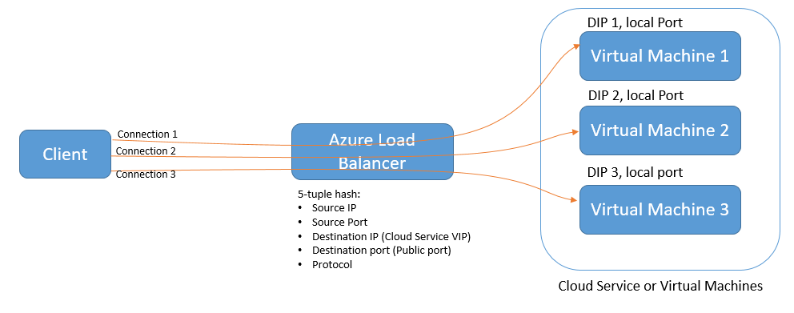
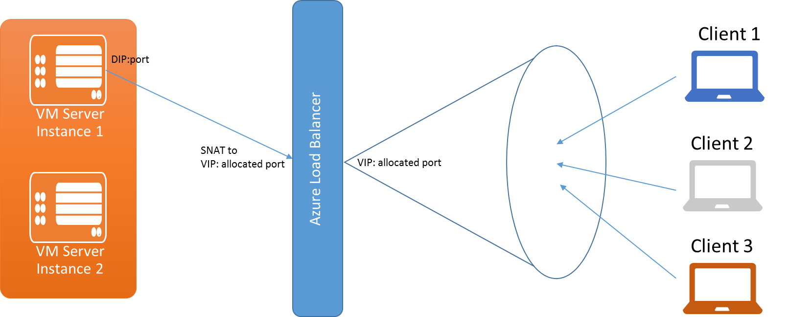

<properties 
   pageTitle="Azure Load Balancer overview | Microsoft Azure"
   description="Overview of Azure load balancer features, architecture and implementation. It helps to understand how load balancer works and leverage it for the cloud"
   services="load-balancer"
   documentationCenter="na"
   authors="joaoma"
   manager="adinah"
   editor="tysonn" />
<tags 
   ms.service="load-balancer"
   ms.devlang="na"
   ms.topic="article"
   ms.tgt_pltfrm="na"
   ms.workload="infrastructure-services"
   ms.date="05/01/2015"
   ms.author="joaoma" />

# Load Balancer Overview 
Azure load balancer delivers high availability and network performance to your applications. It is a Layer-4 (TCP, UDP) type load balancer that distributes incoming traffic among healthy service instances in cloud services or virtual machines defined in a load balancer set.
 
It can be configured to:

- Load balance incoming Internet traffic to virtual machines. We refer it as [Internet facing load balancing](load-balancer-overview.md).
- Load balance traffic between virtual machines in a Virtual Network, between virtual machines in cloud services or between on-premises computers and virtual machines in a cross-premises virtual network. We refer it as [internal load balancing (ILB)](load-balancer-internal-overview.md).
- 	Forward external traffic to a specific Virtual Machine instance

## Load Balancer features

### Layer-4 Load Balancer, Hash based distribution

Azure Load Balancer uses a hash based distribution algorithm. By default it uses is a 5 tuple (source IP, source port, destination IP, destination port, protocol type) hash to map traffic to available servers. It provides stickiness only within a transport session. Packets in the same TCP or UDP session will be directed to the same datacenter IP (DIP) instance behind the load balanced endpoint. When the client closes and re-opens the connection or starts a new session from the same source IP, the source port changes. This may cause the traffic to go to a different DIP endpoint.

For more details on [Load Balancing distribution mode](load-balancer-distribution-mode.md)

### Port Forwarding

Azure Load Balancer provides you control over how inbound communication, such as traffic initiated from Internet hosts or virtual machines in other cloud services or virtual networks is managed. This control is represented by an endpoint (also referred as Input Endpoint).

An endpoint listens on a public port and forwards traffic to an internal port.  You can map the same ports for an internal or external endpoint or use a different port for them. For example: you can have a web server configured listen to port 81 while the public endpoint mapping is port 80. The creation of a public endpoint triggers the creation of an Azure Load Balancer.

The default use and configuration of endpoints on a virtual machine that you create with the Azure Management Portal are for the Remote Desktop Protocol (RDP) and remote Windows PowerShell session traffic. These endpoints allow you to remotely administer the virtual machine over the Internet.

### Automatic reconfiguration on scale out/down

Azure Load Balancer instantly reconfigure itself when you scale up or down instances (either due to increasing the instance count for web/worker role or due to putting additional virtual machines under the same load balanced set).

### Service Monitoring
Azure Load Balancer offers the capability to probe for health of the various server instances. When a probe fails to respond, Azure Load Balancer stops sending new connection to the unhealthy instances. Existing connections are not impacted. 

There are three types of probes supported:
 
- Guest Agent probe (on PaaS VMs only). Azure Load Balancer utilizes the Guest Agent inside the virtual machine, listens and responds with an HTTP 200 OK response only when the instance is in the Ready state (ie. The instance is not in the Busy, Recycling, Stopping, etc states). If the Guest Agent fails to respond with HTTP 200 OK, the Azure Load Balancer marks the instance as unresponsive and stops sending traffic to that instance. The Azure Load Balancer will continue to ping the instance, and if the Guest Agent responds with an HTTP 200, the Azure Load Balancer will send traffic to that instance again.  When using a web role your website code typically runs in w3wp.exe which is not monitored by the Azure fabric or guest agent, which means failures in w3wp.exe (eg. HTTP 500 responses) will not be reported to the guest agent and the load balancer will not know to take that instance out of rotation.

- HTTP custom probes. The custom load balancer probe overrides the default guest agent probe and allows you to create your own custom logic to determine the health of the role instance.  The load balancer will regularly probe your endpoint (every 15 seconds, by default) and the instance will be considered in rotation if it responds with a TCP ACK or HTTP 200 within the timeout period (default of 31 seconds).  This can be useful to implement your own logic to remove instances from load balancer rotation, for example returning a non-200 status if the instance is above 90% CPU.  For web roles using w3wp.exe this also means you get automatic monitoring of your website since failures in your website code will return a non-200 status to the load balancer probe.  

- TCP custom probes. TCP probes rely on successful TCP session establishment to a defined probe port.

For more information, see [load balancer health probe](https://msdn.microsoft.com/library/azure/jj151530.aspx).

### Source NAT (SNAT)

All outbound traffic to Internet originating from your service is Source NATed (SNAT) using the same VIP address as for incoming traffic. SNAT provides important benefits:

- It enables easy upgrade and disaster recovery of services since the VIP can be dynamically mapped to another instance of the service,

- It makes ACL management easier since the ACL can be expressed in terms of VIPs and hence do no change as services scale up or down or get redeployed

Azure Load balancer configuration supports full cone NAT for UDP. Full cone NAT is a type of NAT where the port allows inbound connections from any external host (in response to an outbound request).

Note that for each new outbound connection initiated by a VM, an outbound port is also allocated by Azure Load Balancer. The external host will see traffic coming as VIP: allocated port.  If your scenarios require large number of outbound connections, it is recommended that the VMs uses Instance-Level public IPs so that it has dedicated outbound IP for Source Network Address Translation (SNAT). This will reduce the risk of port exhaustion.

**Support for multiple load balanced IP for Virtual machines**

You can get more than one load balanced public IP address assigned to a set of Virtual machines. With this ability you can host multiple SSL websites and/or multiple SQL Always on Availability group listeners on the same set of Virtual machines. See more at [multiple VIP's per cloud service](load-balancer-multivip.md)

**Template-based deployments using Azure Resource Manager (public preview)** 
Azure Resource Manager (ARM) is the new management framework for services in Azure. Azure Load Balancer can now be managed using Azure Resource Manager-based APIs and tools. To learn more about Azure Resource Manager, see [Iaas just got easier with Azure Resource Manager](http://azure.microsoft.com/blog/2015/04/29/iaas-just-got-easier-again/)

## Next Steps

[Internet facing load balancer overview](load-balancer-internet-overview.md)

[Internal load balancer overview](load-balancer-internal-overview.md)

[Get started - Internet facing load balancer](load-balancer-internet-getstarted.md)
 