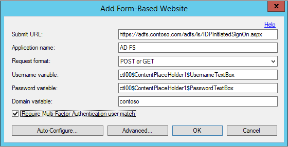
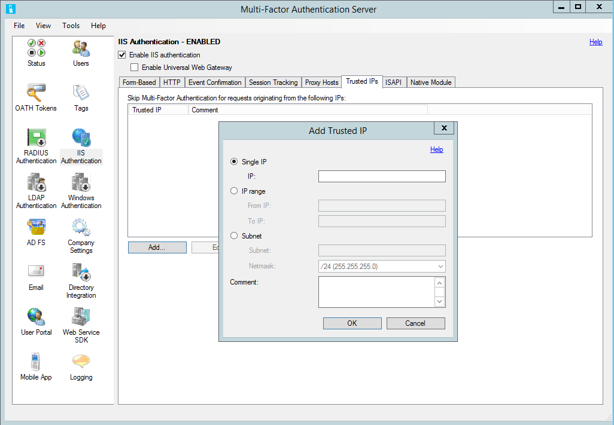

<properties 
	pageTitle="Secure cloud and on-premises resources using Azure Multi-Factor Authentication Server with AD FS 2.0" 
	description="This is the Azure Multi-Factor authentication page that describes how to get started with Azure MFA and AD FS 2.0." 
	services="multi-factor-authentication" 
	documentationCenter="" 
	authors="billmath" 
	manager="terrylan" 
	editor="bryanla"/>

<tags 
	ms.service="multi-factor-authentication" 
	ms.workload="identity" 
	ms.tgt_pltfrm="na" 
	ms.devlang="na" 
	ms.topic="article" 
	ms.date="06/02/2015" 
	ms.author="billmath"/>
# Secure cloud and on-premises resources using Azure Multi-Factor Authentication Server with AD FS 2.0

If your organization is federated with Azure Active Directory and you have resources that are on-premises or in the cloud that you wish to secure you can do this by using the Azure Multi-Factor Authentication Sever and configuring it to work with AD FS so that multi-factor authentication is triggered for high value end points.

This documentation covers using the Azure Multi-Factor Authentication Server with AD FS 2.0.  For infomation on using Azure Multi-Factor Authentication with Windows Serve 2012 R2 AD FS see [Secure cloud and on-premises resources using Azure Multi-Factor Authentication Server with Windows Server 2012 R2 AD FS](multi-factor-authentication-get-started-adfs-w2k12.md).

## AD FS 2.0 proxy
To secure AD FS 2.0 with a proxy, install the Azure Multi-Factor Authentication Server on the ADFS proxy server and configure the Server per the following steps. 

### To secure AD FS 2.0 with a proxy
<ol>
<li>Within the Azure Multi-Factor Authentication Server click the IIS Authentication icon in the left menu.</li>
<li>Click the Form-Based tab.</li>
<li>Click the Add… button.</li>

<li>To detect username, password and domain variables automatically, enter the Login URL (e.g. https://sso.contoso.com/adfs/ls) within the Auto-Configure Form-Based Website dialog box and click OK.</li>
<li>Check the Require Azure Multi-Factor Authentication user match box if all users have been or will be imported into the Server and subject to multi-factor authentication. If a significant number of users have not yet been imported into the Server and/or will be exempt from multi-factor authentication, leave the box unchecked. See the help file for additional information on this feature.</li>
<li>If the page variables cannot be detected automatically, click the Specify Manually… button in the Auto-Configure Form-Based Website dialog box.</li> 
<li>In the Add Form-Based Website dialog box, enter the URL to the ADFS login page in the Submit URL field (e.g. https://sso.contoso.com/adfs/ls) and enter an Application name (optional). The Application name appears in Azure Multi-Factor Authentication reports and may be displayed within SMS or Mobile App authentication messages. See the help file for more information on the Submit URL.</li>
<li>Set the Request format to “POST or GET”.</li>
<li>Enter the Username variable (ctl00$ContentPlaceHolder1$UsernameTextBox) and Password variable (ctl00$ContentPlaceHolder1$PasswordTextBox). If your form-based login page displays a domain textbox, enter the Domain variable as well. You may need to navigate to the login page in a web browser, right-click on the page and select “View Source” to find the names of the input boxes within the login page.</li>
<li>Check the Require Azure Multi-Factor Authentication user match box if all users have been or will be imported into the Server and subject to multi-factor authentication. If a significant number of users have not yet been imported into the Server and/or will be exempt from multi-factor authentication, leave the box unchecked.</li>

<li>Click the Advanced… button to review advanced settings, including the ability to select a custom denial page file, to cache successful authentications to the website for a period of time using cookies and to select how to authenticate the primary credentials.</li>
<li>Since the ADFS proxy server is not likely to be joined to the domain, you will likely use LDAP to connect to your domain controller for user import and pre-authentication. In the Advanced Form-Based Website dialog box, click the Primary Authentication tab and select “LDAP Bind” for the Pre-authentication Authentication type.</li>
<li>When complete, click the OK button to return to the Add Form-Based Website dialog box. See the help file for more information on the advanced settings.</li>
<li>Click the OK button to close the dialog box.</li>
<li>Once the URL and page variables have been detected or entered, the website data will display in the Form-Based panel.</li>
<li>Click the Native Module tab and select the server, the website that the ADFS proxy is running under (e.g. “Default Web Site”) or the ADFS proxy application (e.g. “ls” under “adfs”) to enable the IIS plug-in at the desired level.</li>
<li>Click the Enable IIS authentication box at the top of the screen.</li>
<li>The IIS authentication is now enabled. However, in order to perform the pre-authentication to your Active Directory (AD) via LDAP you must configure the LDAP connection to the domain controller. To do this, click the Directory Integration icon.</li>
<li>On the Settings tab, select the Use specific LDAP configuration radio button.</li> 

<li>Click the Edit… button.</li> 
<li>In the Edit LDAP Configuration dialog box, populate the fields with the information required to connect to the AD domain controller. Descriptions of the fields are included in the table below. Note: This information is also included in the Azure Multi-Factor Authentication Server help file.</li>

Field| Description
:------------- | :-------------
Server|Enter the hostname or IP address of the server running the  LDAP directory.  A backup server may also be specified separated by a semi‐colon.   **Note:** When Bind Type is SSL, a fully‐qualified hostname is  generally required and it must match the name on the SSL  certificate installed on the LDAP directory server. 
Base DN|Enter the distinguished name of the base directory object from  which all directory queries will start.  For example, dc=contoso,dc=com.
Bind type|Select the appropriate bind type for use when binding to search the LDAP directory.  This is used for imports, synchronization, and username resolution.<ul><li>**Anonymous** ‐ An anonymous bind will be performed.  Bind DN and Bind Password will not be used.  This will only work if the LDAP directory allows anonymous binding and permissions  allow the querying of the appropriate records and attributes.</li><li>**Simple** ‐ Bind DN and Bind Password will be passed as plain text to bind to the LDAP directory.  This should only be used for testing purposes to verify that the server can be reached and  that the bind account has the appropriate access.  It is  recommended that SSL be used instead after the appropriate  cert has been installed.</li><li>**SSL** ‐ Bind DN and Bind Password will be encrypted using SSL to bind to the LDAP directory.  This requires that a cert be installed on the LDAP directory server that the Azure Multi-Factor Authentication Server trusts.</li><li>**Windows** ‐ Bind Username and Bind Password will be used to securely connect to an Active Directory domain controller or ADAM directory.  If Bind Username is left blank, the logged‐on  user's account will be used to bind.</li></ul> 
Bind Username|Enter the distinguished name of the user record for the account to use when binding to the LDAP directory.  The bind distinguished name is only used when Bind Type is Simple or  SSL.    
Bind password|Enter the bind password for the Bind DN or username being used to bind to the LDAP directory.  To configure the password for the Multi-Factor Auth Server AdSync Service, synchronization must be enabled and the service must be running on the local machine.   The password will be saved in the Windows Stored Usernames and Passwords under the account the Azure Multi-Factor Authentication Server AdSync  Service is running as.  The password will also be saved under the account the Multi-Factor Auth Server user interface is running as and under the account the Azure Multi-Factor Authentication Server Service is running as.    Note:  Since the password is only stored in the local server's  Windows Stored Usernames and Passwords, this step will need  to be done on each Multi-Factor Auth Server that needs access to the password. 
Query size limit|Specify the size limit for the maximum number of users that a directory search will return.  This limit should match the configuration on the LDAP directory.  For large searches where  paging is not supported, import and synchronization will  attempt to retrieve users in batches.  If the size limit specified  here is larger than the limit configured on the LDAP directory,  some users may be missed. 

<li>Test the LDAP connection by clicking the Test button.</li>

<li>If the LDAP connection test was successful, click the OK button.</li>
<li>Next, click the Company Settings icon and select the Username Resolution tab.</li>
<li>Select the Use LDAP unique identifier attribute for matching usernames radio button.</li>
<li>If users will enter their username into the ADFS proxy login form in “domain\username” format, the Server needs to be able to strip the domain off of the username when it creates the LDAP query. That can be done through a registry setting.</li>
<li>Open the registry editor and go to HKEY_LOCAL_MACHINE/SOFTWARE/Wow6432Node/Positive Networks/PhoneFactor on a 64-bit server. If on a 32-bit server, take the “Wow6432Node” out of the path. Create a new DWORD registry key called “UsernameCxz_stripPrefixDomain” and set the value to 1. Azure Multi-Factor Authentication is now securing the ADFS proxy. Ensure that users have been imported from Active Directory into the Server. See the Trusted IPs section below if you would like to whitelist internal IP addresses so that two-factor authentication is not required when logging into the website from those locations.</li> 

## AD FS 2.0 Direct without a proxy

To secure AD FS when the AD FS proxy is not used, install the Azure Multi-Factor Authentication Server on the AD FS server and configure the Server per the following steps. 

### To secure AD FS 2.0 without a proxy
<ol>
<li>Within the Azure Multi-Factor Authentication Server click the IIS Authentication icon in the left menu.</li>
<li>Click the HTTP tab.</li>
<li>Click the Add… button.</li>
<li>In the Add Base URL dialogue box, enter the URL for the ADFS website where HTTP authentication is performed (e.g. https://sso.domain.com/adfs/ls/auth/integrated) into the Base URL field and enter an Application name (optional). The Application name appears in Azure Multi-Factor Authentication reports and may be displayed within SMS or Mobile App authentication messages.</li>
<li>If desired, adjust the Idle timeout and Maximum session times.</li>
<li>Check the Require Azure Multi-Factor Authentication user match box if all users have been or will be imported into the Server and subject to multi-factor authentication. If a significant number of users have not yet been imported into the Server and/or will be exempt from multi-factor authentication, leave the box unchecked. See the help file for additional information on this feature.</li>
<li>Check the cookie cache box if desired.</li>

<li>Click the OK button.</li>
<li>Click the Native Module tab and select the server, the website that ADFS is running under (e.g. “Default Web Site”) or the ADFS application (e.g. “ls” under “adfs”) to enable the IIS plug-in at the desired level.</li>
<li>Click the Enable IIS authentication box at the top of the screen. Azure Multi-Factor Authentication is now securing ADFS. Ensure that users have been imported from Active Directory into the Server. See the Trusted IPs section below if you would like to whitelist internal IP addresses so that two- factor authentication is not required when logging into the website from those locations.</li>

## Trusted IPs
The Trusted IPs allows users to bypass Azure Multi-Factor Authentication for website requests originating from specific IP addresses or subnets. For example, you may want to exempt users from Azure Multi-Factor Authentication while logging in from the office. For this, you would specify the office subnet as an Trusted IPs entry. 

### To configure trusted IPs

<ol>
<li>In the IIS Authentication section, click the Trusted IPs tab.</li> 
<li>Click the Add… button.</li>
<li>When the Add Trusted IPs dialog box appears, select the Single IP, IP range or Subnet radio button.</li>
<li>Enter the IP address, range of IP addresses or subnet that should be whitelisted. If entering a subnet, select the appropriate Netmask and click the OK button. The whitelist has now been added.</li>

