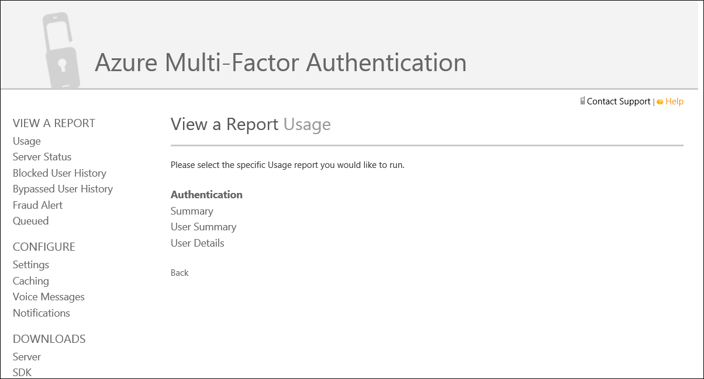

<properties 
	pageTitle="Azure Multi-Factor Authentication Reports" 
	description="This describes how to use the Azure Multi-Factor Authentication feature - reports." 
	services="multi-factor-authentication" 
	documentationCenter="" 
	authors="billmath" 
	manager="terrylan" 
	editor="bryanla"/>

<tags 
	ms.service="multi-factor-authentication" 
	ms.workload="identity" 
	ms.tgt_pltfrm="na" 
	ms.devlang="na" 
	ms.topic="article" 
	ms.date="06/02/2015" 
	ms.author="billmath"/>

# Reports in Azure Multi-Factor Authentication

Azure Multi-Factor Authentication provides several reports that can be used by you and your organization. These reports can be accessed through the Multi-Factor Authentication Management Portal. The following is a list of the available reports.

You can access reports through the Azure Management portal.

Name| Description
:------------- | :------------- | 
Usage | The usage reports display information on overall usage, user summary and user details.
Server Status|This report displays the status of Multi-Factor Authentication Servers associated with your account.
Blocked User History|These reports show the history of requests to block or unblock users.
Bypassed User History|Shows the history of requests to bypass Multi-Factor Authentication for a user's phone number.
Fraud Alert|Shows a history of fraud alerts submitted during the date range you specified.
Queued|Lists reports queued for processing and their status. A link to download or view the report is provided when the report is complete.
 

