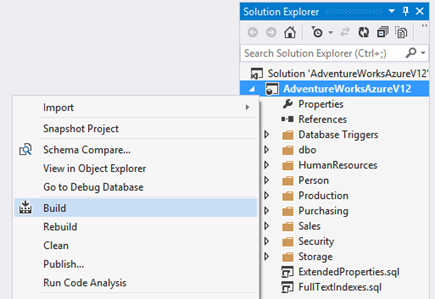
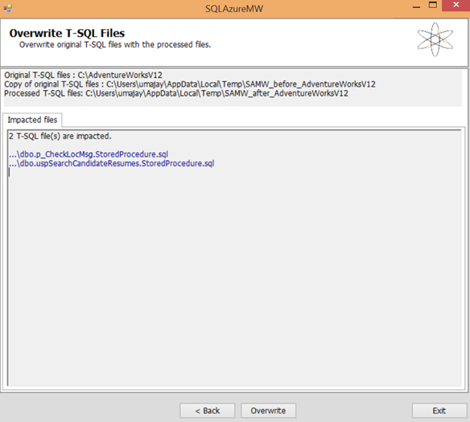
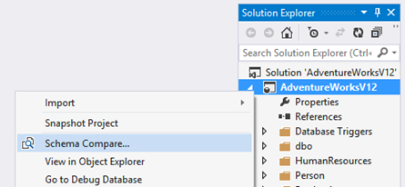
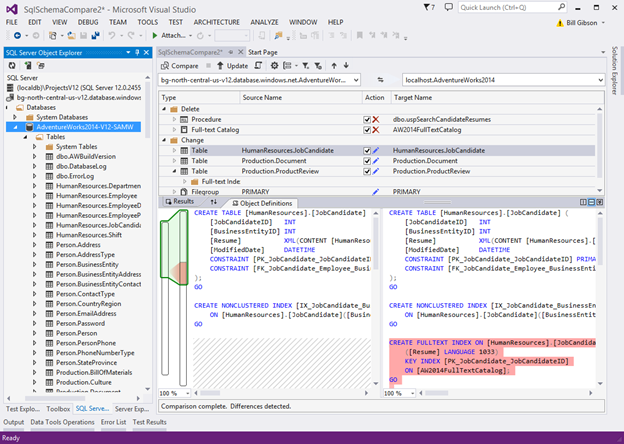

<properties 
   pageTitle="Migration using Visual Studio and SSDT" 
   description="Microsoft Azure SQL Database, database migration, import database, export database, migration wizard" 
   services="sql-database" 
   documentationCenter="" 
   authors="pehteh" 
   manager="jeffreyg" 
   editor="monicar"/>

<tags
   ms.service="sql-database"
   ms.devlang="NA"
   ms.topic="article"
   ms.tgt_pltfrm="NA"
   ms.workload="data-management" 
   ms.date="07/17/2015"
   ms.author="pehteh"/>

#Update database in place then deploy to Azure SQL Database

Use this Option when the migration of a database to Azure SQL Database V12 requires schema changes that cannot be addressed using the SQL Azure Migration Wizard (SAMW) because the database uses SQL Server features that are not supported in Azure SQL Database.  With this option, Visual Studio is first used to create a database project from the source database. The project’s target platform is then set to Azure SQL Database V12 and the project is built to identify all compatibility issues. SAMW can fix many compatibility issues, but not all of them, so SAMW is used to process all the scripts in the projects as a first pass. Using SAMW is optional but highly recommended. Building the project after processing the script files with SAMW will identify remaining issues which must then be addressed manually using the Transact-SQL editing tools in Visual Studio. Once the project builds successfully, the schema is published back to a copy (recommended) of the source database to update its schema and data in situ. The updated database is then deployed to Azure, either directly or by exporting and importing a BACPAC file, using the techniques described in Option #1.
 
As this Option involves updating the schema of the database in situ before deploying to Azure it is strongly recommended to perform this on a copy of the database. The Visual Studio Schema Compare tool can be used to review the full set of changes that will be applied to the database before publishing the project.

Use of the SQL Azure Migration Wizard (SAMW) is optional but recommended. SAMW will detect compatibility issues within the body of functions, stored procedures and triggers which will not otherwise be detected until deployment.

If a schema-only deployment is required, the updated schema can be published directly from Visual Studio to Azure SQL Database.

## Migration Steps

1.	Open the **SQL Server Object Explorer** in Visual Studio. Use **Add SQL Server** to connect to the SQL Server instance containing the database being migrated. Locate the database in the explorer, right click it and select **Create New Project…** 

2.	Configure the import settings to **Import application-scoped objects only**. Uncheck the options to import referenced logins, permissions and database settings.

3.	Click **Start** to import the database and create the project, which will contain a T-SQL script file for each object in the database. The script files are nested in folders within the project.

4.	In the Visual Studio Solution Explorer, right click on the database project and select Properties. This will open the **Project Settings** page on which you should configure the Target Platform to Microsoft Azure SQL Database V12.

5.	Optional: right click on the project and select **Build** to build the project (this is not strictly required at this point, but doing this now will give you a baseline for the number of compatibility issues in the project and the effectiveness of the following steps.)

6.	Optional: Right click on the project and select **Snapshot Project**. By taking a snapshot at the beginning and potentially at later stages during the transformation you can use the Schema Compare tool to compare the schema at each stage.

 
- Snapshotting the project creates a time-stamped .dacpac file that contains the complete schema of the project. You can modify the file name to indicate at what stage in the process this snapshot was taken. 

7.	Process the imported script files using the SQL Azure Migration Wizard (SAMW). Use the folder option and select the root project folder. 

8.	The wizard will process each script file in this folder and all subfolders. A summary of the results will be displayed on the next page.

 
9.	Click next to see a summary list of the files that have been changed. 

> [AZURE.NOTE] Temporary copies are made of both the original files before processing and the impacted files after processing at the locations indicated at the top of the page.

10.	Click **Overwrite** and **OK** in the confirmation dialog and the original files will overwritten with the changed files. Only files that have actually been changed will be overwritten. 
 
11.	Optional. Use Schema Compare to compare the project to an earlier snapshot or to the original database to understand what changes have been made by the wizard. You might want to take another snapshot at this point also. 

12.	Build the project again (see earlier step) to determine what errors remain.

13.	Work through the errors systematically to resolve each issue. Assess the impact of each change on applications that use the database.

14.	When the database is free of errors right click on the project and select **Publish** to build and publish the database to a copy of the source database (it is highly recommended to use a copy, at least initially). The goal of this step is to update the source database schema and make any consequent changes to data in the database. 
- Before you publish, depending on the source SQL Server version, you may need to reset the project’s target platform to enable deployment. If you are migrating an older SQL Server database you must not introduce any features into the project that are not supported in the source SQL Server unless you first migrate the database to a newer version of SQL Server. 
- You must configure the publish step to enable appropriate Publish options. For example, if you have deleted or commented out unsupported objects in the project then these must be deleted from the database so you must allow Publish to delete data in the target database. 
- If you anticipate publishing repeatedly 

15.	Deploy the copied database to Azure SQL Database using the techniques described in Option 1.

## Validating the Migration

Once you have completed the migration it is a good idea to compare the schema in the migrated database with the schema in the source database to familiarize yourself with any changes that have been made to satisfy yourself they are as expected and will not cause any issues when migrating applications to the new database. You can use the Schema Compare tool included with the SQL Server tooling in Visual Studio to perform the comparison. You can compare the database in Azure SQL Database to the original SQL Server database or to a snapshot taken when the database was first imported into the project. 

1.	Connect to the server in the Azure SQL database containing the migrated database and locate the database. 

2.	Right click on the database and select **Schema Compare…** This will open a new schema comparison with the Azure database selected as the source on the left side. Use the Select Target drop down on the right side to select the target database or the snapshot file for the comparison.

3.	With source and target selected click on Compare to trigger the comparison. Loading the schema from a complex database in Azure SQL Database may take a considerable time.  Loading the schema and doing other metadata tasks on an Azure SQL database will take less time with a higher pricing tier.

4.	Once the comparison is complete review the differences. Unless you have any concerns you should not as a rule apply changes to either schema.

In the schema comparison below the Adventure Works 2014 database in Azure SQL Database V12 on the left as transformed and migrated by the SQL Azure Migration Wizard, is compared with the source database in SQL Server on the right. 

